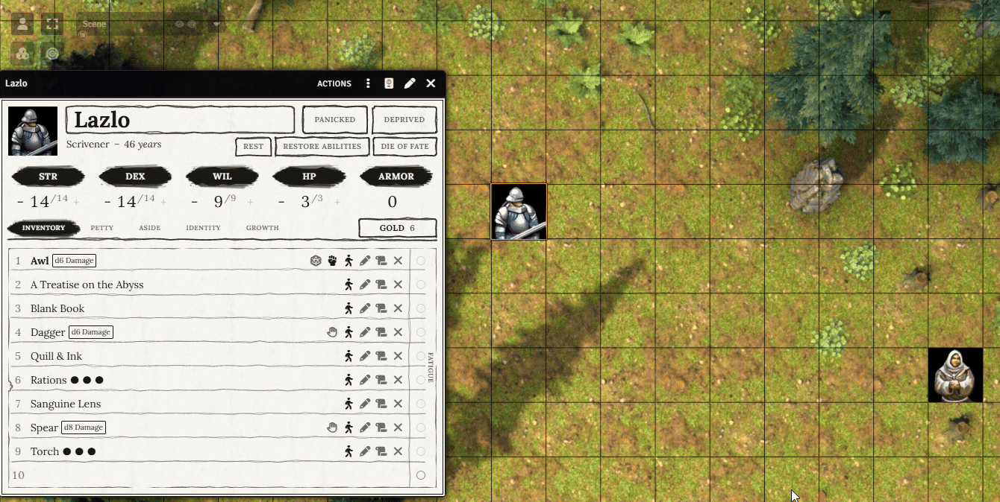
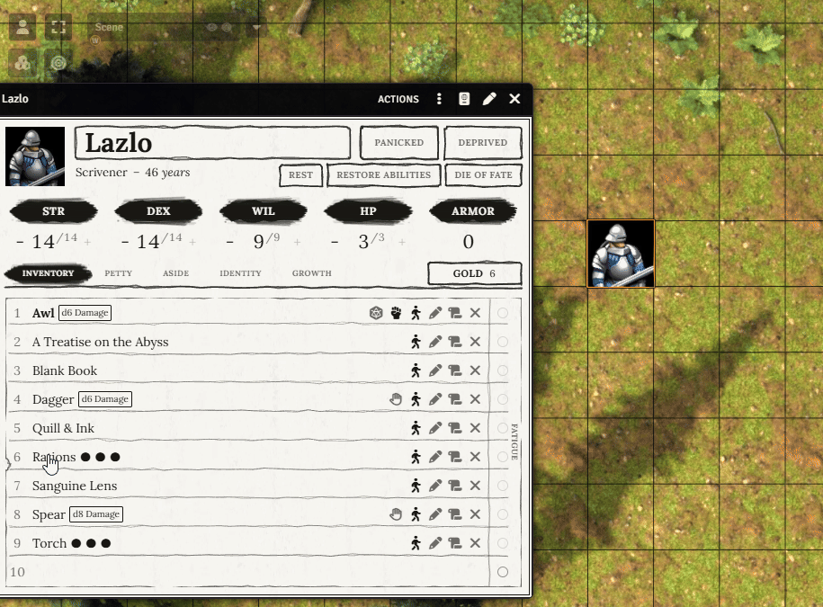
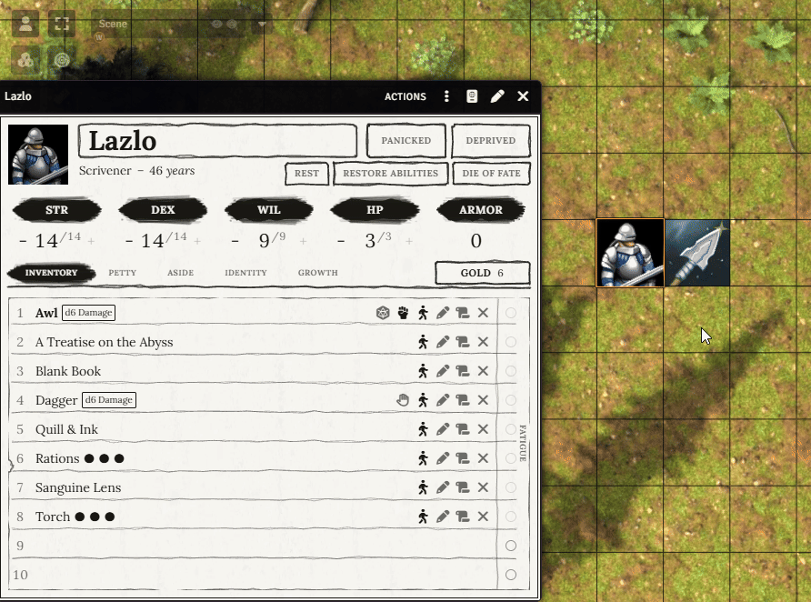
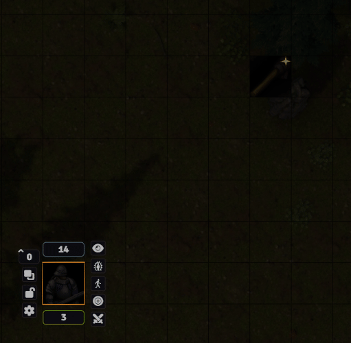

# Canvas Loot

The rogue tosses the healing potion across the room to the fighter. The wizard drops a torch at
the cave entrance for whoever comes next. The goblin's rusty key lies on the floor, waiting for
someone to walk over and pick it up.

Canvas Loot puts items on the map. Drag an item off a character sheet and it lands next to the
token as a tile with the item's picture, or flies across the room when the spot is farther away.
Anyone whose token stands next to it picks it up with one click, and it goes back on their sheet.
Nobody has to ask who has the rope: it is on the map, or on someone's sheet. It works in any system.



[](https://buymeacoffee.com/mestredigital) [](https://mestredigital.online/pages/projetos-en)

## What it does

- Where your token stands matters. You can drop what your token can reach and throw what it
  can't, but not through walls. To pick something up, you have to walk over to it.
- An item is either on a sheet or on the map, never both and never neither. That holds when two
  players grab it at once, and after a Ctrl+Z.
- Dropped items sparkle, shine or hop so players spot them. You can turn that off and let them
  search the room.
- With [Light Sources](https://github.com/brunocalado/light-sources), a lit lantern you drop keeps
  lighting up the floor where it lands.
- Many systems have ready-made settings, and the rest need two simple settings.
- Loot is an ordinary Foundry tile, so the GM moves, hides or deletes it on the Tiles layer like
  any other.

## Dropping an item

Select your token and drag an item from its sheet onto the map, next to the token. The item leaves
the sheet, flies out of the token's hands and lands on that spot, snapped to the grid. Each space
holds one item, so a spot that already holds loot is refused. Dropping part of a stack (ten arrows,
three potions) asks how many, and only those leave the sheet.



While you drag, rings around your token shade where you can drop (green) and throw (amber), bending
around walls. The space under the cursor shows the throw distance, or turns red with the reason the
item can't go there.

The GM can place items anywhere without a token, which is handy for hiding treasure before the
session. Only the GMs are told about it in chat, so the players don't find out.
With the token of the character carrying the item selected, the GM drops and throws by the same
rules as a player.

## Throwing

Drop farther than arm's reach and the item is thrown instead. It flies in an arc from the token
and lands where you pointed, as long as the spot is within throwing range and no wall is in the
way. Hand the healing potion to the friend on the other side of the room, or toss the rope to the
one stuck across the chasm. Every throw plays a whoosh, and the chat tells the table how far it
went.

## Picking it up

Select your token, walk it next to the loot and click it. The item goes back onto your character's
sheet and disappears from the map with a pickup sound. Hover over a piece of loot to see its name.



Picking up arrows when you already carry the same arrows adds them to your existing stack instead
of a second entry (in systems that track quantities). If two players go for the same item, the
first one gets it.

Players can only click loot their tokens can see, and loot the GM hides stays out of their reach.
Whenever someone drops, throws or picks something up, a short chat message tells the table. If you
lose track of where an item landed, click the drop or throw message and the map pans to it.

## Light Sources

Canvas Loot works with [Light Sources](https://github.com/brunocalado/light-sources). A lit
lantern you drop or throw keeps shining where it lands, lighting up the floor around it. Toss a
torch down a dark corridor to see what's waiting there.



## Highlighting loot

Choose how loot draws the eye on the map:

- Sparkle: a twinkling star in the item's corner (the default).
- Shine: a band of light sweeps across the item.
- Jiggle: the item wiggles in place.
- Hop: the item bounces up and down.
- Ring: a circle pulses on the ground around it.
- None: loot sits still, and players have to find it themselves.

Anyone who turns on Foundry's photosensitive mode sees loot at rest, without the animation.

## Settings

All settings are in **Game Settings**, **Configure Settings**, **Canvas Loot**.

- In **Loot highlight**, pick one of the effects above.
- In **Droppable items**, choose which kinds of items can go on the map (a sword, yes; a class
  feature, no) and which field holds an item's quantity. **Restore system defaults** puts the
  ready-made choice back.
- In **Throwing and sounds**, turn throwing off, or set how far a character can throw, from 2 to
  60 grid spaces (30 by default). You can also pick the sounds a throw and a pickup make, and
  their volumes. They play on the Environment volume channel, and leaving a sound empty silences
  it.

Systems with ready-made settings: Alien RPG, Band of Blades, Blades in the Dark, Cairn 2e,
Crucible, Daggerheart, D&D 5e, Draw Steel, Dungeon World, Household, ICRPG, Pathfinder 2e,
Powered by the Apocalypse, Savage Worlds (SWADE), Scum and Villainy, Simple Worldbuilding,
Starfinder 2e, Tormenta20, Twodsix, Vagabond and World of Darkness 5e.

On any other system it still works: every kind of item starts droppable, and items move whole
until you tell **Droppable items** which field holds the quantity.

## Getting started

1. Enable the module in your world.
2. Open **Droppable items** and check that the item types and the quantity field fit your system.
   On a system from the list above, this is already done.
3. Play. A player selects their token and drags an item from the sheet onto the map. To pick it
   back up, they walk next to it and click.

A GM must be connected for loot to be dropped or picked up, because the GM's client is the one
that places and removes the loot on the map.

## For developers

Modules, systems and macros can put loot on the map too, with a flight of their own. The API finds
free spaces for it, away from other loot and from tokens. See the
[API documentation](docs/API.md).

## Installation

Requires Foundry VTT v14. Install via the Foundry VTT Module browser or use this manifest link:

```js
https://github.com/brunocalado/canvas-loot/releases/latest/download/module.json
```

Optional: install [Light Sources](https://github.com/brunocalado/light-sources) too, so dropped
torches and lanterns keep burning.

# 📜 License

* GNU General Public License version 3. See `LICENSE`.

* whoosh and pick-up https://pixabay.com/service/license-summary/
